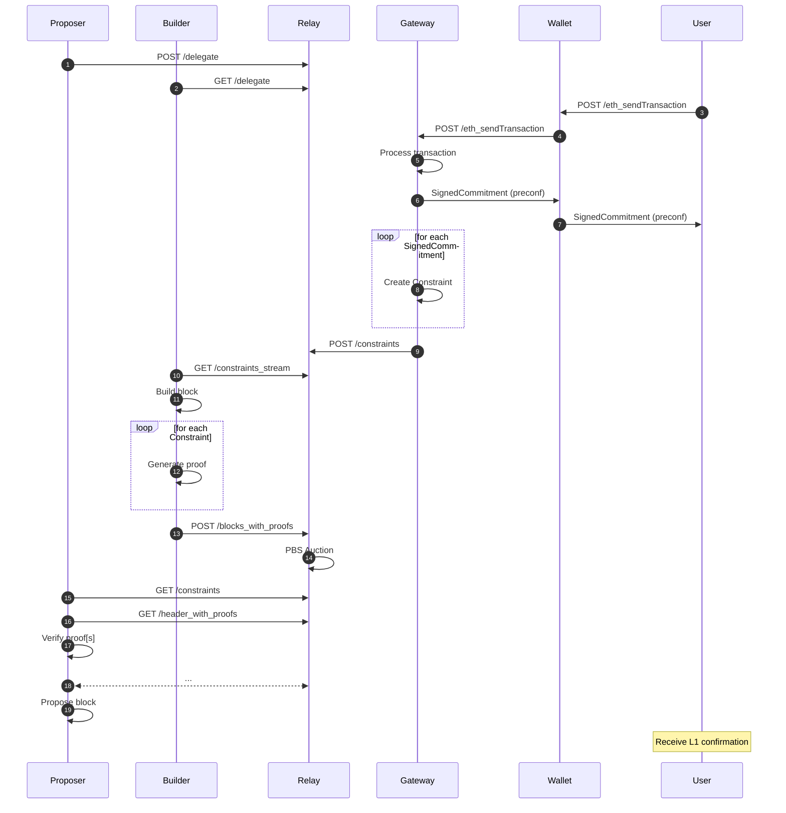

# Constraints API Specification

## Abstract

A proposed generic API that allows constraints to be specified during the block building process, enabling the existing PBS architecture to more easily support arbitrary proposer commitment protocols.

This is modified version of the generic constraints specification, specific to Interstate: https://github.com/eth-fabric/constraints-specs/blob/main/specs/constraints-api.md

## Motivation

Many Ethereum proposers already delegate their block-building responsibilities to more sophisticated actors via PBS, but today, this delegation is largely all-or-nothing, giving proposers little control over individual transaction inclusion or ordering.

We want proposers to have the ability to make more fine-grained commitments. One important example is preconfirmations, where proposers can give ahead-of-time guarantees about the inclusion or execution of transactions within their slots. This approach offers a pathway to faster user experiences without requiring changes to Ethereum’s core protocol (i.e., 2 second slot times). Instead of implementing a hard fork, we can enhance the existing out-of-protocol PBS architecture to support more flexible proposer commitments.

Since the proposer commitment space is still nascent, our goal is to design a generic and future-proof API that can accommodate arbitrary proposer commitments, including but not limited to preconfirmations.


## API Scope

**In Scope** (Constraints API)

- the delegation of block-building responsibilities from proposers to gateways
- the submission of constraints to the relay
- the retrieval of constraints from the relay
- the submission of blocks and proofs of constraint validity to the relay
- the retrieval of block headers and proofs of constraint validity from the relay

**Out of Scope** (Commitments API)
- any interaction between third parties (Users, Wallets, etc) and the Gateway.
- commitments from Gateways to third parties

# Terminology

| Term           | Description                                                                                                                                    |
|----------------|------------------------------------------------------------------------------------------------------------------------------------------------|
| Proposer       | An Ethereum validator with the rights to propose an L1 block. |
| Commitment     | A binding message commiting the proposer to perform an action as part of their block proposal duties. |
| Constraint     | Instructions for block builders to build blocks that adhere to proposer commitments. |
| Delegation     | A binding message signed by a Proposer to delegate Constraint and Commitment submission authority. Self-delegations are allowed but if delegated to a third party, they are referred to as a Gateway. |
| Gateway        | The third party with Constraint and Commitment submission authority granted by the Proposer. |
| Builder        | A party specialized in constructing Execution Payloads and providing proofs that Constraints are followed. |
| Relay          | A party that facilitates message passing. This includes the fair exchange of Execution Payloads and Constraints proofs between Builders and Proposers, Constraints between Gateways and Builders, and Delegations between Proposers and Gateways.    |

# API Summary

| **Namespace** | **Method** | **Endpoint** | **Description** |
| --- | --- | --- | --- |
| `constraints`   | `POST` | /constraints/v0/builder/constraints        | Endpoint for Proposer or Gateway to submit a batch of signed constraints to the Relay. |
| `constraints`   | `POST` | /constraints/v0/builder/delegate           | Endpoint for Proposer to delegate constraint submission rights to a Gateway. |
| `constraints`   | `GET` | /constraints/v0/builder/header_with_proofs  | Endpoint for Proposer to request a builder bid with proof of constraint validity. |
| `constraints`   | `GET` | /constraints/v0/builder/capabilities         | Endpoint to retrieve the constraint capabilities of the Relay. |
| `constraints`   | `GET` | /constraints/v0/relay/delegations         | Endpoint to retrieve the signed delegations for the proposer of a given slot, if it exists. |
| `constraints`   | `GET` | /constraints/v0/relay/constraints         | Endpoint to retrieve the signed constraints for a given slot. |
| `constraints`   | `GET` | /constraints/v0/relay/constraints_stream  | Endpoint to retrieve an SSE stream of signed constraints. |
| `constraints`   | `POST` | /constraints/v0/relay/blocks_with_proofs | Endpoint for Builder to submit a block with proofs of constraint validity to the Relay. |
| `constraints`   | `GET`  | /constraints/v0/relay/blocks_satisfying_constraints | This endpoint allows the validator to receive only blocks that satisfy the constraints submitted by gateway. Validator can submit any block received from this endpoint and satisfy constraints|

# Constraints API Endpoints


## Proposer-facing API

### Endpoint: `/constraints/v0/builder/constraints`

Endpoint for submitting a batch of constraints to the relay. The constraints are expected to be signed by a `delegate` BLS private key, whose corresponding public key is specified in a `SignedDelegation` message defined below.

- **Method:** `POST`
- **Response:** Empty
- **Headers:**
    - `Content-Type: application/json`
- **Body:** JSON object of type `SignedConstraints[]`

- **Schema**

    ```python
    # A signed "bundle" of constraints.
    class SignedConstraints(Container):
        message: ConstraintsMessage
        signature: BLSSignature

    # A "bundle" of constraints for a specific slot.
    class ConstraintsMessage(Container):
        proposer: BLSPubkey
        delegate: BLSPubkey
        slot: uint64
        constraints: List[Constraint]
        receivers: List[BLSPubkey]

    # A constraint for transaction[s]
    class Constraint(Container):
        constraintType: uint64
        payload: Bytes
    ```

- **Description**

    For each `Commitment` the delegate signs, they will need to create a matching `Constraint`. Collectively, a `SignedConstraints` message is posted to the relay.

    - `constraintType`: unsigned 64-bit number between `0` and `0xffffffffffffffff` that represents the type of the proposer commitment
    - `payload`: opaque byte array whose interpretation is dependent on the `constraintType`

    Particularly each `constraintType` would have a corresponding spec that defines:
    - a schema for a `Commitment` and `SignedCommitment` message
    - how a `Constraint.payload` is interpreted
    - how a `Constraint.payload` is created given a `SignedCommitment`
    - the ordering of `constraints[]`
    - how to build a valid block given a `ConstraintsMessage`
    - how to generate proofs of constraint validity
    - how to verify proofs of constraint validity

    Additional requirements:

    - To ensure deterministic behavior for stateful constraints it is required for the ConstraintsMessage.Constraints[] to be processed in the order received.
    - The ConstraintsMessage.Receivers[] field contains a list of public keys that are authorized to access these constraints. If this list is empty, the constraints are publicly accessible to anyone.

- **Example**

    While the Commitments API is out of scope, the following example demonstrates how a proposer might use the Constraints API to commit to a set of transactions.

    - Assume a user wants their L1 transaction to be included at slot `N`.
    - The user's wallet creates a `Commitment` message and sends it to the delegated Gateway via the Commitments API, receiving a `SignedCommitment` in return.
    - The Gateway creates a `Constraint` message, where the `constraintType` corresponds to the `Commitment` - in this case a generic L1 inclusion preconfirmation.
    - After aggregating other commitments, the Gateway sends the `SignedConstraints` to the Relay, who makes them available to Builders.
    - Builders will compete to build the best block that satisfies the constraints.
    - Before committing to a builder's block, the proposer can verify the constraints were followed by checking the constraint proofs against the block header.
    - Upon block proposal, the user's preconfirmed transaction is included in the L1.

    As demonstrated by this example, the Constraints API does not have any opinions on the exact nature of the `Constraint` or `Commitment` messages, rather the schema is left generic to support arbitrary proposer commitments. Inevitably there will be some common `commitmentTypes` and `constraintTypes` that the community can align on but this is out of scope for the Constraints API.
---

### Endpoint: `/constraints/v0/builder/delegate`

Endpoint for a Proposer to delegate constraint submission rights to a Gateway. The `SignedDelegation` message is posted to a Relay who makes this available.

- **Method:** `POST`
- **Response:** Empty
- **Headers:**
    - `Content-Type: application/json`
- **Body:** JSON object of type `SignedDelegation`

- **Schema**
    ```python
    # A signed delegation
    class SignedDelegation(Container):
        message: Delegation
        signature: BLSSignature

    # A delegation from a proposer to a BLS public key
    class Delegation(Container):
        proposer: BLSPubkey
        delegate: BLSPubkey
        committer: Address
        slot: Slot
        metadata: Bytes
    ```

- **Description**

    A proposer can delegate constraint submission rights by signing a `Delegate` message with their `proposer` BLS private key. A `SignedDelegation` binds the `proposer` public key to the `delegate` public key and a `committer` address for the specified `slot`. During this time, the `delegate` can submit constraints to the relay on behalf of the `proposer`.

    - `proposer`: The BLS public key of the proposer who is delegating constraint submission rights.
    - `delegate`: The BLS public key of the gateway who is receiving constraint submission rights.
    - `committer`: The address of a committer ECDSA key for issuing commitments via the Commitments API.
    - `slot`: The slot number that a `SignedDelegation` is valid for.
    - `metadata`: Additional opaque byte array reserved for Gateways to interpret.

    While the Constraints API aims to be unopinionated about how slasher contracts are implemented, it's assumed that `SignedDelegation` messages are part of the evidence used to slash a proposer.
---

### Endpoint: `/constraints/v0/builder/header_with_proofs/{slot}/{parent_hash}/{pubkey}`

Endpoint for requesting a builder bid with constraint proofs from a Relay.

- **Method:** `GET`
- **Response:** `VersionedSignedBuilderBidWithProofs`
- **Parameters:**
    - `slot`: `string` (regex `[0-9]+`)
    - `parent_hash`: `string` (regex `0x[a-fA-F0-9]+`)
    - `pubkey`: `string` (regex `0x[a-fA-F0-9]+`)
- **Body:** Empty

- **Schema**
    ```python
    class VersionedSignedBuilderBidWithProofs:
        ... # All regular fields from VersionedSignedBuilderBid, additionally
        proofs: ConstraintProofs

    class ConstraintProofs(Container):
        constraintTypes: List[uint64, MAX_CONSTRAINTS_PER_SLOT]
        payloads: List[Bytes, MAX_CONSTRAINTS_PER_SLOT]
    ```

- **Description**

    The `VersionedSignedBuilderBidWithProofs` schema extends `VersionedSignedBuilderBid` from the [original builder specs](https://ethereum.github.io/builder-specs/#/Builder/getHeader) to include proofs of constraint validity. Without leaking the block's contents, a Proposer can verify that the block satisfies the constraints by checking the `proofs` against the block header. To support a wide range of constraint types with different proving requirements, `ConstraintProofs` is left open-ended to allow for future flexibility.

    - `constraintTypes`: list of unsigned 64-bit numbers between `0` and `0xffffffffffffffff` that represents the type of the proposer commitment (not required to be homogeneous)
    - `payloads`: list of opaque byte arrays whose interpretation is dependent on the `constraintTypes`

- **Requirements**:
    - each `constraintType` has a spec that defines how builders can generate `proofs` for their block
    - each `constraintType` has a spec that defines how relays and proposers can verify `proofs`
    - When serializing, the `proofs` field must be present in `data`, at the same level of `signature` and `message`. See the example below.
    - The length of `constraintTypes` and `payloads` must be the same

- **Example Payload**
    ```python
    # constraintType = 0x00
    class InclusionProof(Container):
        tx_hash: Bytes32
        index: uint64
        merkle_hashes: List[Bytes32]

    # example inclusion proofs
    proof_0 = InclusionProof(
        tx_hash="0xcf8e...", index=7, merkle_hashes=["0xa7bc...", "0xd912...", ...]
    ).ssz_encode()

    proof_1 = InclusionProof(
        tx_hash="0x9fbb...", index=9, merkle_hashes=["0xeeab...", "0x1a2c...", ...]
    ).ssz_encode()

    # example envelope for multiple proofs
    proofs = ConstraintProofs(
        constraintTypes=[0x00, 0x00],
        payloads=[
            proof_0,
            proof_1,
        ],
    )
    ```

- **Example Response**
    ```json
    {
        "version": "deneb",
        "data": {
            "message": {
                "header": {
                    "parent_hash": "0xcf8e0d4e9587369b2301d0790347320302cc0943d5a1884560367e8208d920f2",
                    "fee_recipient": "0xabcf8e0d4e9587369b2301d0790347320302cc09",
                    "state_root": "0xcf8e0d4e9587369b2301d0790347320302cc0943d5a1884560367e8208d920f2",
                    "receipts_root": "0xcf8e0d4e9587369b2301d0790347320302cc0943d5a1884560367e8208d920f2",
                    "logs_bloom": "0x00000000000000000000000000000000000000000000000000000000000000000000000000000000000000000000000000000000000000000000000000000000000000000000000000000000000000000000000000000000000000000000000000000000000000000000000000000000000000000000000000000000000000000000000000000000000000000000000000000000000000000000000000000000000000000000000000000000000000000000000000000000000000000000000000000000000000000000000000000000000000000000000000000000000000000000000000000000000000000000000000000000000000000000000000000000",
                    "prev_randao": "0xcf8e0d4e9587369b2301d0790347320302cc0943d5a1884560367e8208d920f2",
                    "block_number": "1",
                    "gas_limit": "1",
                    "gas_used": "1",
                    "timestamp": "1",
                    "extra_data": "0xcf8e0d4e9587369b2301d0790347320302cc0943d5a1884560367e8208d920f2",
                    "base_fee_per_gas": "1",
                    "blob_gas_used": "1",
                    "excess_blob_gas": "1",
                    "block_hash": "0xcf8e0d4e9587369b2301d0790347320302cc0943d5a1884560367e8208d920f2",
                    "transactions_root": "0xcf8e0d4e9587369b2301d0790347320302cc0943d5a1884560367e8208d920f2",
                    "withdrawals_root": "0xcf8e0d4e9587369b2301d0790347320302cc0943d5a1884560367e8208d920f2"
                },
                "blob_kzg_commitments": [
                    "0xa94170080872584e54a1cf092d845703b13907f2e6b3b1c0ad573b910530499e3bcd48c6378846b80d2bfa58c81cf3d5"
                ],
                "value": "1",
                "pubkey": "0x93247f2209abcacf57b75a51dafae777f9dd38bc7053d1af526f220a7489a6d3a2753e5f3e8b1cfe39b56f43611df74a"
            },
            "proofs": {
                "constraintTypes": [0x00, 0x00],
                "payloads": ["0x5097...", "0x932587..."]
            },
            "signature": "0x1b66ac1fb663c9bc59509846d6ec05345bd908eda73e670af888da41af171505cc411d61252fb6cb3fa0017b679f8bb2305b26a285fa2737f175668d0dff91cc1b66ac1fb663c9bc59509846d6ec05345bd908eda73e670af888da41af171505"
        }
    }
    ```
---

### Endpoint: `/constraints/v0/builder/capabilities`

Endpoint to retrieve the constraint capabilities of the Relay.

- **Method:** `GET`
- **Parameters:** None
- **Headers:** None
- **Response:** `ConstraintCapabilities`

- **Schema**
    ```python
    class ConstraintCapabilities(Container):
        constraintTypes: List[uint64]
    ```
---

- **Example Response**
    ```json
    {
        "constraintTypes": [0x00, 0x01]
    }
    ```

- **Description**

    The `ConstraintCapabilities` object defines the constraint types that the Relay supports. Gateways and Builders can use this to update their software accordingly.
---

## Builder-facing API

### Endpoint: `/constraints/v0/relay/delegations/{slot}`

Return the active delegations for the proposer of this slot, if they exist.

- **Method:** `GET`
- **Response:** `SignedDelegation[]`
- **Parameters:**
    - `slot`: `string` (regex `[0-9]+`)
- **Body:** Empty

- **Example Response**
    ```json
    [
        {
            "message": {
                "proposer": "0x93247f2209abcacf57b75a51dafae777f9dd38bc7053d1af526f220a7489a6d3a2753e5f3e8b1cfe39b56f43611df74a",
                "delegate": "0x84e47f2209abcacf57b75a51dafae777f9dd38bc7053d1af526f220a7489a6d3a2753e5f3e8b1cfe39b56f43611df74b",
                "committer": "0xabcf8e0d4e9587369b2301d0790347320302cc09",
                "slot": "12345",
                "metadata": "0xe9587369b2301d0790347320302cc069b2301d0790347320302cc0943d5a1884560367e8208d920f2e9587369b2301de9587369b2301d0790347320302cc0"
            },
            "signature": "0x1b66ac1fb663c9bc59509846d6ec05345bd908eda73e670af888da41af171505cc411d61252fb6cb3fa0017b679f8bb2305b26a285fa2737f175668d0dff91cc1b66ac1fb663c9bc59509846d6ec05345bd908eda73e670af888da41af171505"
        }
    ]
    ```

- **Description**

    The Relay should only return signed delegations that were signed by the proposer.

---


### Endpoint: `/constraints/v0/relay/constraints/{slot}`

Returns all signed constraints for a given slot, if they exist. The request requires authorization via the `X-Receiver-Signature` header which is a BLS signature over the requested `slot` number. If there are restrictions on accessing constraints, the Relay will check the signature against the BLS public keys in `ConstraintsMessage.Receivers[]`.

- **Method:** `GET`
- **Response:** `SignedConstraints[]`
- **Parameters:**
    - `slot`: `string` (regex `[0-9]+`)
- **Body:** Empty
- **Headers:**
    - `Content-Type: application/json`
    - `X-Receiver-Signature: <BLS signature>`

- **Example Response**
    ```json
    [
        {
            "message": {
                "proposer": "0x93247f2209abcacf57b75a51dafae777f9dd38bc7053d1af526f220a7489a6d3a2753e5f3e8b1cfe39b56f43611df74a",
                "delegate": "0x93247f2209abcacf57b75a51dafae777f9dd38bc7053d1af526f220a7489a6d3a2753e5f3e8b1cfe39b56f43611df74a",
                "slot": "12345",
                "constraints": [
                    {
                        "constraintType": "0x00",
                        "payload": "0x301d0790347320302cc0943d5a1884560367e8208d920f2e9587369b2301de9587369b2301d0790347320302cc0"
                    },
                    {
                        "constraintType": "0x01",
                        "payload": "0x367e8208d920f2e9587369b2301de9587369b2301d0790347320302cc0301d0790347320302cc0943d5a1884560367e8208d920f2e958"
                    }
                ],
                "receivers": [
                    "0x93247f2209abcacf57b75a51dafae777f9dd38bc7053d1af526f220a7489a6d3a2753e5f3e8b1cfe39b56f43611df74a",
                    "0x84e47f2209abcacf57b75a51dafae777f9dd38bc7053d1af526f220a7489a6d3a2753e5f3e8b1cfe39b56f43611df74b"
                ]
            },
            "signature": "0x1b66ac1fb663c9bc59509846d6ec05345bd908eda73e670af888da41af171505cc411d61252fb6cb3fa0017b679f8bb2305b26a285fa2737f175668d0dff91cc1b66ac1fb663c9bc59509846d6ec05345bd908eda73e670af888da41af171505"
        }
    ]
    ```

- **Description**

    The Relay should only return signed constraints that were signed by the proposer or a gateway that was delegated to by the proposer.

---

### Endpoint: `/constraints/v0/relay/constraints_stream/{slot}`

Returns a stream of constraints via Server-Sent Events (SSE). The request requires authorization via the `X-Receiver-Signature` header which is a BLS signature over the requested `slot` number. If there are restrictions on accessing constraints, the Relay will check the signature against the BLS public keys in `ConstraintsMessage.Receivers[]`.

- **Method:** `GET`
- **Response:**  Server-sent events containing `SignedConstraints[]` objects
- **Parameters:**
    - `slot`: `string` (regex `[0-9]+`)
- **Body:** Empty
- **Headers**:
    - `Content-Type: text/event-stream`
    - `Cache-Control: no-cache`
    - `Connection: keep-alive`
    - `X-Receiver-Signature: <BLS signature>`
- **Example Response**
    ```json
    event: json
    data: [
        {
            "message": {
                "proposer": "0x93247f2209abcacf57b75a51dafae777f9dd38bc7053d1af526f220a7489a6d3a2753e5f3e8b1cfe39b56f43611df74a",
                "delegate": "0x93247f2209abcacf57b75a51dafae777f9dd38bc7053d1af526f220a7489a6d3a2753e5f3e8b1cfe39b56f43611df74a",
                "slot": "12345",
                "constraints": [
                    {
                        "constraintType": "0x00",
                        "payload": "0x301d0790347320302cc0943d5a1884560367e8208d920f2e9587369b2301de9587369b2301d0790347320302cc0"
                    },
                    {
                        "constraintType": "0x01",
                        "payload": "0x367e8208d920f2e9587369b2301de9587369b2301d0790347320302cc0301d0790347320302cc0943d5a1884560367e8208d920f2e958"
                    }
                ],
                "receivers": [
                    "0x93247f2209abcacf57b75a51dafae777f9dd38bc7053d1af526f220a7489a6d3a2753e5f3e8b1cfe39b56f43611df74a",
                    "0x84e47f2209abcacf57b75a51dafae777f9dd38bc7053d1af526f220a7489a6d3a2753e5f3e8b1cfe39b56f43611df74b"
                ]
            },
            "signature": "0x1b66ac1fb663c9bc59509846d6ec05345bd908eda73e670af888da41af171505cc411d61252fb6cb3fa0017b679f8bb2305b26a285fa2737f175668d0dff91cc1b66ac1fb663c9bc59509846d6ec05345bd908eda73e670af888da41af171505"
        }
    ]

    ```
- **Description**

    This endpoint is a streaming endpoint meant to reduce round-trip latency via SSE, allowing Relays to push new constraints to Builders in realtime.
    The Relay should only return signed constraints that were signed by the proposer or a gateway that was delegated to by the proposer.
---

### Endpoint: `/constraints/v0/relay/blocks_with_proofs?cancellations={cancellations}`

Endpoint for submitting blocks with proofs of constraint validity to a Relay.

- **Method:** `POST`
- **Parameters:**
    - `cancellations`: `bool` (query)
- **Headers:**
    - `Content-Type: application/json`
- **Body:** JSON object of type `VersionedSubmitBlockRequestWithProofs`
- **Response:** Empty

- **Schema**
    ```python
    class VersionedSubmitBlockRequestWithProofs:
        ... # All regular fields from VersionedSubmitBlockRequest, additionally
        proofs: ConstraintProofs

    class ConstraintProofs(Container):
        constraintTypes: List[uint64, MAX_CONSTRAINTS_PER_SLOT]
        payloads: List[Bytes, MAX_CONSTRAINTS_PER_SLOT]
    ```

- **Description**

    The `VersionedSubmitBlockRequestWithProofs` schema extends `VersionedSubmitBlockRequest` from the [original relay specs](https://flashbots.github.io/relay-specs/#/Builder/submitBlock) to include proofs of constraint validity. A Builder can protect their block's content while proving that the block satisfies the constraints by including proofs in the `VersionedSubmitBlockRequestWithProofs` message. To support a wide range of constraint types with different proving requirements, `ConstraintProofs` is left open-ended to allow for future flexibility.

    - `constraintTypes`: list of unsigned 64-bit numbers between `0` and `0xffffffffffffffff` that represents the type of the proposer commitment (not required to be homogeneous)
    - `payloads`: list of opaque byte arrays whose interpretation is dependent on the `constraintTypes`
    - if `cancellations` is true, the Builder is signaling to opt into bid cancellations

- **Requirements**:
    - each `constraintType` has a spec that defines how builders can generate `proofs` for their block
    - each `constraintType` has a spec that defines how relays and proposers can verify `proofs`
    - The length of `constraintTypes` and `payloads` must be the same

- **Example Payload**
    ```json
    {
    "message": {
        "slot": "102",
        "parent_hash": "0x65b83b421bce1cd05bce2d86eb3233122c150e790770a0083e767a137bb5a2ed",
        "block_hash": "0xd1f43eacf8061a694b2bbe0798b1e50b99084cfdf136ba1fd5ec020f14271010",
        "builder_pubkey": "0xaa1488eae4b06a1fff840a2b6db167afc520758dc2c8af0dfb57037954df3431b747e2f900fe8805f05d635e9a29717b",
        "proposer_pubkey": "0xae5302796cfeca685eaf37ffd5baeb32121f2f07415bee26cc0051ee513ff3932d2c365e3d9f87b0949a5980445cb64c",
        "proposer_fee_recipient": "0x8943545177806ED17B9F23F0a21ee5948eCaa776",
        "gas_limit": "27616981",
        "gas_used": "295536",
        "value": "418266798562488"
    },
    "execution_payload": {
        "parent_hash": "0x65b83b421bce1cd05bce2d86eb3233122c150e790770a0083e767a137bb5a2ed",
        "fee_recipient": "0x8943545177806ED17B9F23F0a21ee5948eCaa776",
        "state_root": "0x41a8bd9993a0efd49767892963cb30ea9695fc7ccab1f3deee417aa269a92f77",
        "receipts_root": "0x37677efb710ba86196a244c77746aff51c1c9f73c86d233485b8052d94716022",
        "logs_bloom": "0x00000000000000000000000000000000000000000000000000000000000000000000000000000000000000000000000000000000000000000000000000000000000000000000000000000000000000000000000000000000000000000000000000000000000000000000000000000000000000000000000000000000000000000000000000000000000000000000000000000000000000000000000000000000000000000000000000000000000000000000000000000000000000000000000000000000000000000000000000000000000000000000000000000000000000000000000000000000000000000000000000000000000000000000000000000000",
        "prev_randao": "0x77a34ab437d022f25433b37fc311c4115c4f691c5737caf93779b70a0e4d4c95",
        "block_number": "102",
        "gas_limit": "27616981",
        "gas_used": "295536",
        "timestamp": "1731939746",
        "extra_data": "0x496c6c756d696e61746520446d6f63726174697a6520447374726962757465",
        "base_fee_per_gas": "1882",
        "block_hash": "0xd1f43eacf8061a694b2bbe0798b1e50b99084cfdf136ba1fd5ec020f14271010",
        "transactions": [
        "0xf86f820154845acf6ba0825208946177843db3138ae69679a54b95cf345ed759450d87071afd498d0000808360306ca0210d69b34df72b8067d2e57961d525a5a8856ef9e8d16be96852db57bdc6aeada04dc401eeb7801b1f6b9efe1d843189bbfdca1acf8802810cee1d703f2649a50b",
        "0xf86f820155845acf6ba082520894687704db07e902e9a8b3754031d168d46e3d586e87071afd498d0000808360306ba0f11e0e52e772e58b1ad64aa919293e735a936a2b414677599b83b815053b42afa041894c134e87cdb095be478c170ea9442eb312d3505524ff478194fd29ac723d",
        "0xf86f820156845acf6ba08252089415e6a5a2e131dd5467fa1ff3acd104f45ee5940b87071afd498d0000808360306ca04bd1b80b7c1f4c2510247f42f7342c5291c67a15109f8d4e7cc73bf929e53cf2a060bb7a9994cd2a70794db653d801f56d33408b4dca456cf62d80325718ad43e0",
        "0xf86f820157845acf6ba08252089480c4c7125967139acaa931ee984a9db4100e0f3b87071afd498d0000808360306ba0dfb605c47f84cd9b0c4f90f39308e10e00bfaff38d4905ee211f51f3389cc272a021f37a9064ba4b98431a8c614c6f2ab02c8d6ffd2d4c6d896405cdac1386ed66",
        "0xf86f820158845acf6ba082520894d08a63244fcd28b0aec5075052cdce31ba04fead87071afd498d0000808360306ca05b046b8ff98792bde534233dea5f15cfe24d37963e77da9379813c4ced89dab6a007c2bd7de299aba36c60651c29302868ac94dcb4064db1cee96c6381da4ead7f",
        "0xf86f820159845acf6ba0825208940b06ef8be65fcda88f2dbae5813480f997ee8e3587071afd498d0000808360306ba09a1850c2f6080f662f983dcab161a83290a2b98792401e40d8bea15838cfce22a007e0cb2ae9b0057071820677783e4a2f7a04aeeb8faab7981b434ad1d9a24e5f",
        "0xf86f82015a845acf6ba0825208941cb96c5809da5977f99f69c11ee58bae5711c5f187071afd498d0000808360306ba071f5330b3d38b57e1c24dbbe82a86387d2310043a669fc5d7492dd88c192df02a05d78693952297460ccc4c8beaf3ec9b99653571d6539e5bcadbf7921e1f8728d",
        "0xf86f82015b845acf6ba0825208942aa48ee899410a6d97c01b0bb0eeaf1771cc435b87071afd498d0000808360306ca0d35d384046f37f9d1da5400df25b930a1692ca2a3a15684b973fdbd40cf34f4fa02906f6122f69991a2ca8b4edba5efc3f3982a85540182101985ce8e292ddbfff",
        "0xf86f82015c845acf6ba08252089407b9d920dd8e8d83dc1125c94fc0b3cdcdf602fb87071afd498d0000808360306ba0f85ab12940b7c5057958a090b9f3bac0a6a7cbcba5c93e818f14d6e24938bcfea0476cc76f82d36da2b2a77d0e520de992dd737508f54c2e710f68c45d6905d962",
        "0xf86f82015d845acf6ba082520894fcb6e353ad4f79245c7cb704abcffe2f4868424187071afd498d0000808360306ca0a50e3fe9877e524676ce519f34e7917f72ef6da9ca075ed65130eb7b828875f0a03764f3dfbf7e656e818dab076b31f223fd2486c275452e283f5e2d062b2e8b67",
        "0x02f8908330182480845acf6267845acf75718254ae94614561d2d143621e126e87831aef287678b442b8830186a0a0c20e0240904510085d38aa992039f3ec5a3bb57f7ede6f8924f86c810d261270c001a0993040420b9f88e6e94654d3d4bba64dfd942356d932137682a9ee9b68c08e1aa017127aa42b78c91c57de1dbb5b2852923977bc22c60ffc3e64796885311be88b",
        "0x02f8908330182401845acf6267845acf75718254ae94614561d2d143621e126e87831aef287678b442b8830186a0a006f8188796440f23e951c43dabc12708faf18f8e8f84417d1333945b86894cc3c001a0edf40236b9cdfbb25cda8810484340e9d5b1e1023922b37b1d483a5d1fb3f130a00c9ce488f82ce829caafa5c97e187a657f49414360307076bec56de53aabb918",
        "0x02f8908330182402845acf6267845acf75718254ae94614561d2d143621e126e87831aef287678b442b8830186a0a09498dae671e12a4df22225c07db38b1b6c4bf4207b9e49fb10062918fb9d4d8fc001a0a8038bf97cc0f7bc742b7b319b4d98154300eb941746f53c48362c55df1913d6a0728550ffc7c06da44f2d6d356285bc24236eac6628a879d5072321eb73d071e4",
        "0x02f86e83301824068082075a825208948943545177806ed17b9f23f0a21ee5948ecaa77687017c6953f31cb880c001a0462fb6848c16e585b786e4fc168bd20a3cb180ebf00e34b93fed9c42b0df0e76a03ac159e02cee545d3e24be5fbd26f902626e18bcf6626f50a7636d4de28834e7"
        ],
        "withdrawals": [],
        "blob_gas_used": "0",
        "excess_blob_gas": "0"
    },
    "signature": "0x86ee27935ac26ea3f6f8ed0f5bf44500809628cbe003dba4867462481d6a7ea97e13b41220b30181a38d3aeebde61de50e166e05968b03666e2708da3f8311e14848c58c0003b5e6eedc2e6de0dfe6fedbe15fe676bcd6ec867ff60a712b7166",
    "proofs": {
        "constraintTypes": [0x00, 0x00],
        "payloads": ["0x5097...", "0x932587..."]
    },
    "blobs_bundle": { "commitments": [], "proofs": [], "blobs": [] }
    }
    ```
---

# Annotated Sequence Diagram


- (1) Proposer signs `Delegation` with their validator BLS key

- (2-3) Gateways and RPC Routers fetch `SignedDelegation` messages from Relay

- (4-6) User sends a transaction via their Wallet which is routed to the correct Gateway

- (7-10) Gateway processes transaction and returns `SignedCommitment` (preconf) to User

- (11) Gateway creates `Constraint` for each `SignedCommitment`

- (12) Gateway sends `SignedConstraints` to Relay

- (13) Builder subscribes to `SignedConstraints` from Relay

- (14-15) Builder builds block and proofs of constraint validity

- (16) Builder sends `VersionedSubmitBlockRequestWithProofs` to Relay

- (17) Relay verifies proofs and performs standard PBS auction

- (18-20) Proposer verifies block follows constraints by checking proofs against the block header

- (21) Continuation of standard PBS protocol

- (22) Proposer proposes block to L1, and User receives L1 confirmation
